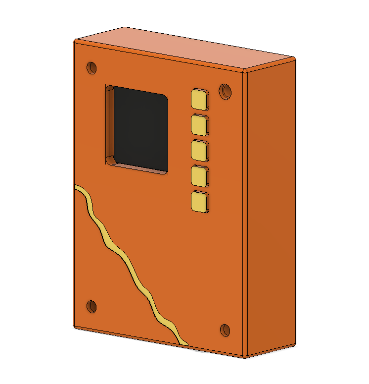
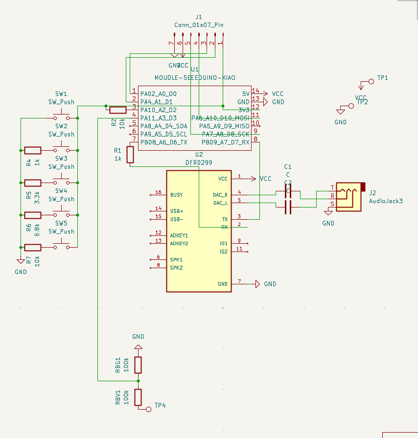
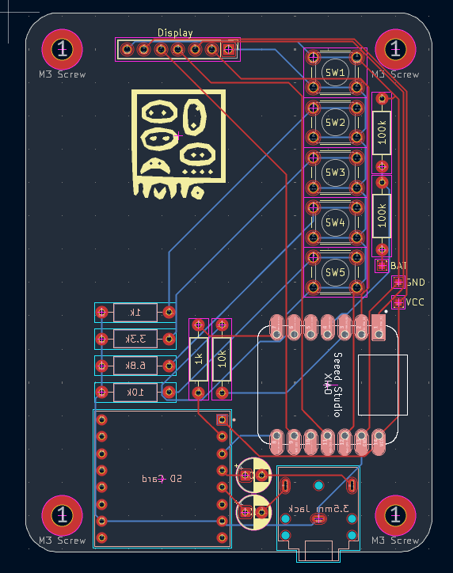

# WePod

Wepod is Our Ipod, it is an open source MP3 Player that uses the Xiao RP2040

PS: All images of the PCB, CAD and Schematics are on the assets folder if u wanna see.

## Features:
- 1.3 Inch TFT Display
- 5 Button
- SD Card Reader
- 3.5mm Jack
- Powered by any 5V Supply using the dedicated pads

## CAD Model:
Everything fits in a sandwich kind of way by stacking the bottom and top case parts and inbetween the PCB. It requires 4 M3x3 brass inserts and 4 15mm M3 Screws.
It has 3 different printed pieces. The Bottom part of the case where everything will sit in. The Top part that locks everything and the Butons (5 Needed).
Made in Fusion360 cuz its free.

## PCB
It was made in KiCad. Only needing to add Kicad Care package Symbols and Footprints for the Xiao RP2040 and a bunch of other symbols found in SnapEDA.
All 3D models were found on GrabCad

**Schematic:**

**PCB Layout:**

## Firmware Overview
The WePod uses C++ as its language of choice and it was made with the help of generative AI since im not really good at coding.

## BOM:
Here should be everything you need to make this hackpad

- 1.3 Inch TFT display
- DFPlayer
- 3.5mm Jack
- 5x 6x6mm buttons
- 1x XIAO RP2040
- 1x Case (3 printed parts)
- A Bunch of Resistors (1k, 3.3k, 6.8k, 10k and 100k)
- 2x 10uf Capacitors

## Extra stuff
This was my first Original project since my first was the MacroPad so not using a siplified code made me want to die. Conclusion: Hardware is life and coding Sucks